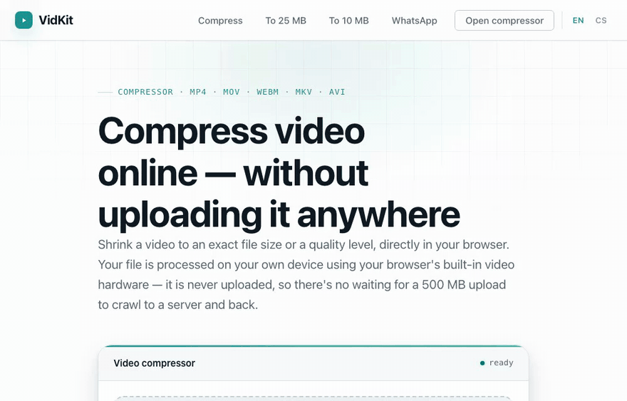

# VidKit

**Free, browser-based video tools that never upload your files.** Compress and
convert video entirely on your own device — there is no server, so your footage
never leaves your machine.

🔗 **Live:** https://vidkit.eu

[](LICENSE)
[](https://vidkit.eu/#privacy)
[](e2e/privacy.spec.ts)



*A 36 MB clip compressed to a target size in seconds, on-device via WebCodecs.
Try it at [vidkit.eu/compress-video](https://vidkit.eu/compress-video/).*

## Why it's private

Every other "online video compressor" uploads your video to a server, processes
it there, and sends it back. VidKit doesn't have a server that could receive
your file. All processing runs **locally in your browser**:

- **Zero file upload.** Not the bytes, not the filename, not the size — nothing
  about your file is ever transmitted. You can verify it yourself: open your
  browser's Network tab while compressing and watch it stay silent.
- **No cookies, no cross-site tracking, no accounts.** The only data collected
  is cookieless, aggregate page-view counts (Umami) — never anything about your
  files.
- **No watermarks, no sign-up, no file-count limits.**
- This guarantee is **enforced by an automated test** (`e2e/privacy.spec.ts`):
  any request to a non-allowlisted host, or any request carrying a body, fails
  the build.

## What it does

- **Compress** video to an exact file size (e.g. 25 MB for email, 10 MB for
  Discord, 16 MB for WhatsApp) or to a quality level.
- **Convert** between formats: MP4, MOV, MKV, WebM, plus audio extraction to
  MP3 / M4A and animated GIF.
- Side-by-side before/after preview before you download.
- English and Czech, with a non-intrusive language suggestion (no auto-redirect).
- A maintained reference of
  [video upload size limits for every platform](https://vidkit.eu/video-upload-size-limits/)
  (Discord, WhatsApp, Gmail, TikTok, …), verified against official docs.

## How it works

- **WebCodecs API** does the heavy lifting where available — hardware-
  accelerated, often faster than the video plays.
- **ffmpeg.wasm** is a lazy-loaded fallback for formats/codecs WebCodecs can't
  handle (WebM, MP3, GIF, AVI input). The ~9.7 MB core is only fetched when
  actually needed.
- [`mediabunny`](https://github.com/Vanilagy/mediabunny) handles fast container
  parsing and muxing.

## Tech

Vanilla TypeScript + [Vite](https://vitejs.dev). No framework, plain CSS with
custom properties. Ships as a fully static site (hosted on Cloudflare Pages).
Every tool is its own static, crawlable HTML page.

## Develop

Requires Node 22 (see `.nvmrc`).

```bash
npm install        # also fetches + gzips the ffmpeg core (postinstall)
npm run dev        # http://localhost:5173
npm run build      # type-check + production build into dist/
npm run preview    # serve the production build
```

### Test

```bash
npm run test:unit  # pure-logic unit tests (Node test runner)
npm run test:e2e   # Playwright: compression, conversion, and the privacy audit
```

## Third-party notices

- **ffmpeg.wasm** (`@ffmpeg/core`) is licensed under the **GPL/LGPL**; it is a
  separate dependency fetched via npm and served as-is. Its source is available
  from the [ffmpeg.wasm project](https://github.com/ffmpegwasm/ffmpeg.wasm).
- `mediabunny` and other dependencies retain their respective licenses.

VidKit's own source code is licensed under the **MIT License** — see
[LICENSE](LICENSE).
